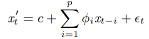

# VAR-model

## Abstract

This project focuses on using Vector Autoregressive (VAR) models to examine the dynamic relationships between variables in time series data. The goal is to estimate an accurate VAR model using an unsupervised approach to forecast existing values, detect anomalous multivariate time series data, and predict probable corrections through iterative minimum repairing. In a VAR model, each variable is modeled as a function of its past values, with the predictors being the lags of the series.

### Remark

The training dataset used in this project can be found at `https://raw.githubusercontent.com/selva86/datasets/master/Raotbl6.csv`.

## Walk through

1. Visualize the data by running `VisualizeMultiData.py`.
2. Split the series into training and testing data by running `SplitData.py`.
3. Detect anomalies by running `VarTrain.py`. This script fits the VAR model using the selected lag and calculates the squared errors of the data. The squared errors are then used to determine a threshold above which observations are considered anomalies.
4. Check for stationarity or make the time series stationary by running `model.py`. A stationary time series has characteristics such as mean and variance that do not change over time. If the series is not stationary, it can be differenced until it becomes stationary. Note that differencing reduces the length of the series by 1.
5. Test for causation using Granger’s Causality Test by running `GrangersCausalityTest.py`. This test checks whether past values of one time series can be used to predict another time series in the system. The null hypothesis is that the coefficients of past values in the regression equation are zero, meaning that past values of one time series do not cause changes in another time series. If the p-value obtained from the test is less than 0.05, you can reject the null hypothesis.
6. Perform a cointegration test by running `CointegrationTest.py`. This test helps establish whether there is a statistically significant connection between two or more time series. If a linear combination exists between two or more time series and has an order of integration less than that of the individual series, then the collection of series is said to be cointegrated and has a statistically significant relationship.

### Theory behind VAR model formula

#### Univariate case: auto regressive model (AR(p))

where x′t is the prediction of xt, p is the order, φi is a model parameter, c is a constant defined by c = µ(1− i=1pφi), µ is the mean value of the process, and t is white noise.

#### Univariate case with partially labeled data: (ARX(p))

where y′t is the possible repair of xt, yt-i is composed of partially labeled data, and other variables are as defined in the AR model.

#### Multivariate case: (VAR(p))

where Yt=(Y1t,...,YKt)' is a set of K time series variables, C is a K × 1 vector of constants, Ai’s are K×K coefficient matrices, and t are error terms.

To select the order (p) of the VAR model, train the VAR model using different lag orders and choose the order with the lowest AIC score. To check for serial correlation of residuals (errors), use a statistic such as Durbin-Watson.

#### Output matrix

In this case, the output matrix is as shown below:

If there is any correlation left in the residuals, it means that there is still some pattern in the time series that the model has not explained. In this situation, you can either increase the order of the model, add more predictors to the system, or try a different algorithm to model the time series.

#### Durbin Watson’s Statistic

The value of this statistic ranges from 0 to 4. A value close to 2 indicates no significant serial correlation, while a value close to 0 indicates positive serial correlation and a value close to 4 indicates negative serial correlation.

### Forecast results

The forecast results are shown below:

To evaluate the forecasts, you can compute a comprehensive set of metrics, including MAPE, ME, MAE, MPE, RMSE, corr, and minmax.

### Iterative minimum repairing on multivariate data

#### Univariate case

The goal is for the term  to converge after a certain number of forecasts. By applying this principle to multivariate data in its stationary form, we can obtain a vector threshold and repair detected anomalies.

### Conclusion

In an unsupervised machine learning context, vector autoregressive (VAR) models work best when used with a partially labeled history dataset. However, they can still provide credible results when used with unlabeled data as long as there is causation between time series and the best lag order is selected.
